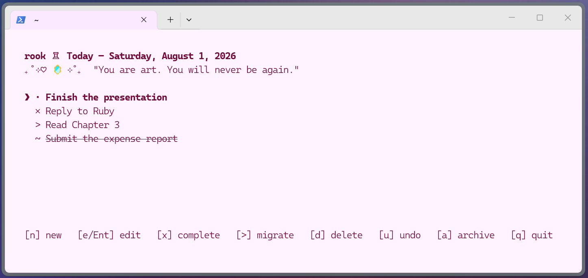

# Rook ♖

A local, keyboard-first terminal journal for working through one day at a time.

<p align="center">
  
</p>

Rook is inspired by the simplicity of a paper bullet journal:

- one active list: **Today**
- direct, in-place editing
- local SQLite storage
- read-only history
- no accounts, cloud sync, reminders, priorities, or telemetry
- at midnight, completed tasks archive, migrated tasks carry over, and the list re-sorts alphabetically

## Installation

Requires Python 3.10 or newer. Install with [uv](https://docs.astral.sh/uv/):

```powershell
uv tool install rook-cli
```

Then launch:

```powershell
rook
```

To check your installed version:

```powershell
rook --version
```

To upgrade later:

```powershell
uv tool upgrade rook-cli
```

## Keyboard reference

| Key | Action |
|-----|--------|
| `n` | New task |
| `e` or `Ent` | Edit selected task |
| `x` | Toggle complete |
| `>` | Toggle migrated — carries the task forward to tomorrow |
| `d` | Soft-delete (shows `~` and strikethrough) / permanently remove (press twice) |
| `u` | Undo last action |
| `a` | Open weekly archive |
| `↑` / `↓` | Move selection |
| `Esc` | Cancel edit |
| `q` | Quit |

> **Mac note:** strikethrough on soft-deleted tasks requires a terminal that supports it. macOS Terminal.app does not; [iTerm2](https://iterm2.com), Alacritty, and kitty do. The `~` bullet still appears regardless of terminal.

## Data and privacy

Tasks are stored in a local SQLite database. Nothing leaves your machine.

| Platform | Location |
|----------|----------|
| Windows  | `%LOCALAPPDATA%\Rook\data.sqlite3` |
| macOS    | `~/Library/Application Support/Rook/data.sqlite3` |
| Linux    | `~/.local/share/rook/data.sqlite3` |

To print the exact path on your system:

```powershell
rook --data-path
```

Uninstalling Rook does not delete the database. To wipe all data and start fresh:

```powershell
rook --reset
```

## FAQ

**How do I change the archive week layout from Sun–Sat to Mon–Sun?**

```powershell
rook --week-start monday
```

To switch back to Sunday-start:

```powershell
rook --week-start sunday
```

## License

Copyright (c) 2026 Janvi Chawla. All Rights Reserved.

Personal use permitted. No redistribution or derivative works without permission.
